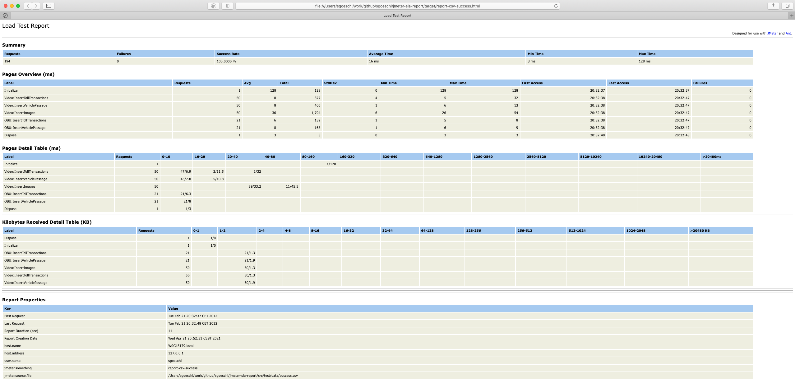

# JMeter SLA Report

## 1. Introduction 

The 'jmeter-sla-report' is a replacement for the existing XSLT-based reporting backend when running JMeter from the command line to solve the following problems

* Using XSLT does not scale for large JTL files therefore a StAX parser is used
* Merge multiple JTL files into one report when multiple JMeter instances are used
* Often you are interested in the distribution of the response time using a logarithmic scale
* Adding a generic way to capture the JMeter configuration data
* Group error messages in the SLA report

This component was created when testing a large application using JMeter (see http://people.apache.org/~sgoeschl/presentations/apachecon-2011/jmeter.pdf)

## 2. Getting Started

In order to generate your first JMeter SLA reports run the following commands

```
mvn clean install
ant test
```

This builds the 'jmeter-sla-report' library and generates three SLA reports using

* JMeter JTL files (aka XML)
* JMeter CSV file

whereas the following JMeter SLA reports are generated

* ./target/report-xml-success.html
* ./target/report-csv-success.html
* ./target/report-xml-failure.html

Afterwards you see a report similiar to the image below



## 3. ANT Integration

The following snippet is used to generate the JMeter SLA report

```
<!-- setup the class path to run the report -->
<path id="project.class.path">
  <fileset dir="${basedir}/lib">
    <include name="*.jar"/>
  </fileset>    
  <fileset dir="${basedir}/target">
    <include name="*.jar"/>
  </fileset>        
</path>       

<target name="report-xml-success" description="Report with XML JMeter file">
  <mkdir dir="${project.build.directory}"/>
  <java classname="org.apache.jmeter.extra.report.sla.Main" classpathref="project.class.path">
    <arg value="${project.build.directory}/report-xml-success.html"/>        
    <arg value="${basedir}/src/test/data/success.jtl"/>
    <sysproperty key="jmeter.foo" value="foo"/>
    <sysproperty key="jmeter.bar" value="bar"/>
  </java>        
</target>  
```

Let's dissect the ANT calls

* setting up an Ant path variable to pull in all required libraries
* invoking "org.apache.jmeter.extra.report.sla.Main" to generate a report which requires two parameters
   * the HTML report file to be generated
   * one or more JTL files written by JMeter
* the remaining "sysproperty" entries prefixed with "jmeter" are added to the reporting section - any system property prefixed with "jmeter" is added to the report automatically so can determine the configuration used to run JMeter (or add any other relevant information)

## 3. The Implementation

A quick overview of the implementation

* The JTL file is parsed using a StaX parser which extracts one 'httpSample' after another
* The 'httpSample' is used to feed JAMon (see http://jamonapi.sourceforge.net) which calculates the SLA related data
* When the parsing is finished all the data is pulled from JAMon and written to HTML file with embedded CSS

## 4. Current State

* Tried to contribute it to Apache JMeter to no avail
* Dumped it on GitHub since this is a much better place than my local hard disk
* Collected a few patches from the Vienna Hackergarden (thanks a lot)
* Licenced under ASL 2.0
* Feel free to use and/or contribute


